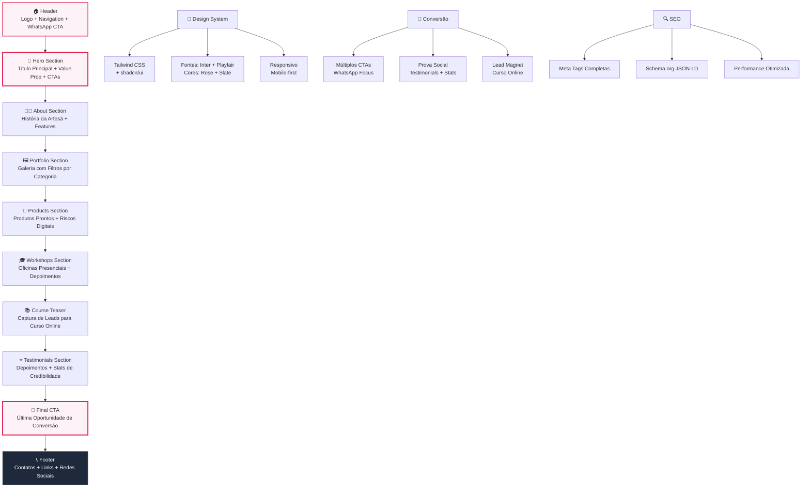

# Arte em Bordados - Landing Page

Uma landing page moderna e otimizada para conversão, criada para apresentar os produtos e serviços de bordado livre artesanal.

## 🎯 Características

- **Design Responsivo**: Adaptado para todos os dispositivos
- **Otimizado para SEO**: Meta tags completas e estrutura semântica
- **Alta Conversão**: Design focado em CTAs e experiência do usuário
- **Acessibilidade**: Seguindo as melhores práticas de acessibilidade
- **Performance**: Carregamento rápido e otimizado

## 🛠️ Tecnologias

- **Astro** - Framework principal
- **React** - Componentes interativos
- **TypeScript** - Tipagem estática
- **Tailwind CSS** - Estilização utilitária
- **shadcn/ui** - Biblioteca de componentes
- **Lucide React** - Ícones

## 📋 Seções da Landing Page

1. **Header + Hero** - Apresentação principal com CTA
2. **Sobre a Artesã** - História pessoal e credibilidade
3. **Portfólio** - Galeria de trabalhos organizados por categoria
4. **Produtos** - Loja com produtos prontos e riscos digitais
5. **Oficinas** - Cursos presenciais em Blumenau
6. **Curso Online** - Teaser para captação de leads
7. **Depoimentos** - Prova social e credibilidade
8. **CTA Final** - Última oportunidade de conversão
9. **Footer** - Informações de contato e links

## 🚀 Como executar

```bash
# Instalar dependências
yarn install

# Executar em desenvolvimento
yarn dev

# Construir para produção
yarn build

# Visualizar build de produção
yarn preview
```

## 📸 Imagens Necessárias

### **Estrutura de pastas sugerida:**
```
public/
├── og-image.jpg                    # Imagem para redes sociais (1200x630px)
├── apple-touch-icon.png           # Ícone para dispositivos Apple (180x180px)
├── portfolio/
│   ├── porta-alianca-1.jpg        # Porta aliança rosa delicada (600x400px)
│   ├── porta-alianca-2.jpg        # Porta aliança clássico (600x400px)
│   ├── porta-maternidade-1.jpg    # Porta maternidade jardim encantado (600x400px)
│   ├── porta-maternidade-2.jpg    # Porta maternidade lua e estrelas (600x400px)
│   ├── decorativo-1.jpg           # Mandala floral decorativa (600x400px)
│   └── decorativo-2.jpg           # Quadro decorativo flores (600x400px)
├── products/
│   ├── porta-alianca-produto.jpg  # Produto porta aliança (400x300px)
│   ├── riscos-maternidade.jpg     # Preview riscos maternidade (400x300px)
│   ├── quadro-flores.jpg          # Quadro bordado com flores (400x300px)
│   ├── riscos-mandala.jpg         # Preview riscos mandala (400x300px)
│   ├── porta-maternidade-produto.jpg # Produto porta maternidade (400x300px)
│   └── kit-iniciante.jpg          # Preview kit riscos iniciante (400x300px)
└── testimonials/
    ├── maria-fernanda.jpg          # Foto cliente (100x100px) - opcional
    ├── ana-clara.jpg              # Foto cliente (100x100px) - opcional
    ├── juliana-costa.jpg          # Foto cliente (100x100px) - opcional
    ├── rosana-lima.jpg            # Foto cliente (100x100px) - opcional
    ├── camila-rodrigues.jpg       # Foto cliente (100x100px) - opcional
    └── patricia-muller.jpg        # Foto cliente (100x100px) - opcional
```

### **Imagens Principais Necessárias:**

1. **Hero Section**: Imagem da artesã trabalhando ou composição artística dos produtos (800x600px)
2. **Sobre a Artesã**: Foto profissional da artesã em seu ateliê (500x600px)
3. **Ateliê**: Foto do espaço das oficinas, ambiente acolhedor (600x400px)
4. **Curso Online**: Mockup da plataforma ou capturas das videoaulas (400x250px)

## 🎨 Paleta de Cores

- **Rosa Principal**: `#E11D48` (rose-600)
- **Rosa Claro**: `#FDF2F8` (rose-50)
- **Cinza Escuro**: `#1E293B` (slate-800)
- **Cinza Médio**: `#64748B` (slate-500)
- **Branco**: `#FFFFFF`

## 📱 Contatos para Configurar

### **WhatsApp (Atual: número fake)**
- Linha 6: `const whatsappUrl = "https://wa.me/5547999999999...`
- Substituir `5547999999999` pelo número real

### **Redes Sociais**
- Instagram: `src/components/Footer.tsx` - linha 10
- Facebook: `src/components/Footer.tsx` - linha 11

### **E-mail**
- E-mail de contato: `src/components/Footer.tsx` - linha 95

## 🔧 Customizações Recomendadas

1. **Integração com Email Marketing** (CourseTeaser.tsx):
   - Mailchimp, ConvertKit ou similar para o teaser do curso

2. **Analytics**:
   - Google Analytics
   - Google Tag Manager
   - Pixel do Facebook

3. **Chat/WhatsApp Widget**:
   - Widget flutuante do WhatsApp

## 📈 SEO Otimizações

- ✅ Meta tags completas
- ✅ Schema.org JSON-LD
- ✅ Sitemap automático (Astro)
- ✅ URLs amigáveis
- ✅ Performance otimizada
- ✅ Estrutura semântica

## 🎯 Conversão - Elementos Implementados

- **Múltiplos CTAs** estrategicamente posicionados
- **Prova social** (depoimentos, números, avaliações)
- **Senso de urgência** (turmas limitadas)
- **Benefícios claros** em cada seção
- **Formulário de lead** (curso online)
- **WhatsApp como canal principal** de contato

## 📞 Suporte

Para dúvidas sobre implementação ou customizações, consulte a documentação oficial:
- [Astro Docs](https://docs.astro.build/)
- [Tailwind CSS](https://tailwindcss.com/)
- [shadcn/ui](https://ui.shadcn.com/)

---

